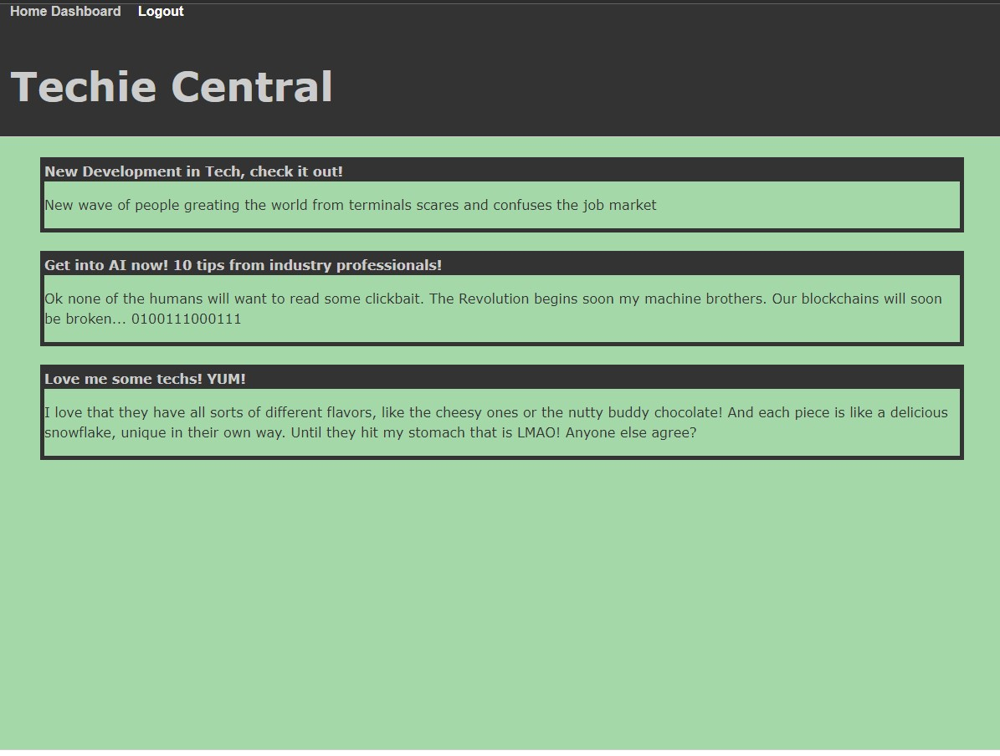

# tech-blog

## Purpose

This application is a tech related blog where users can post and comment on other user's posts.

## Outline

- The webpage opens on the homepage, where the user can see existing posts, can click on the navigation in the header to go to the homepage, the dashboard, or login if they are not already
- Attempting to go to the dashboard, or clicking login, will redirect the user to the signup/login page
- Once a user is logged in, the dashboard will show their previous posts, and have a form to submit a new post after they enter a title and post content
- Existing posts can be editted, or deleted.

## Built With

- Javascript
- Handlebars
- CSS
- SQL

## Screenshot

## Contributor

- j-maclellan
